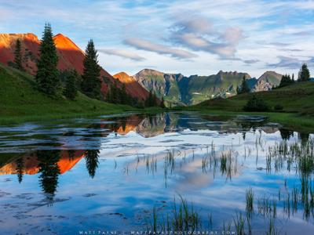

# A Spatial Median Filter for noise removal in digital images
**An implementation of** *J. C. Church, Yixin Chen and S. V. Rice, "A Spatial Median Filter for noise removal in digital images," IEEE SoutheastCon 2008, 2008, pp. 618-623, doi: 10.1109/SECON.2008.4494367.*

<!-- ## Directory
1. [Original Sample Images](./src-imgs)
2. [Preprocessed Images](./preproc-imgs)
3. Utilities
   1. [Script to standardize source images](./preprocessing.mlx)
   2. [Function to add noise to images](./distort.mlx)
   3. [Script to generate noisy sample images](./make_noisy_imgs.mlx)
   4. [Function to ](./make_mask.mlx) -->

## Todo
### General
- [x] Folder for source images
- [x] Folder for loaded./preprocessed images
- [x] Function for distorting images
- [x] Folders for distorted images (matrix), grouped based on distortion level
- [ ] Folders for reconstructed images (matrix), grouped based on distortion level and filter
- [ ] Reconstructed images visualize into image files as examples placed in a folder.
- [ ] Functions for each of the filter
- [x] Function for RMSE calculation
- [ ] Functions for statistical analysis and visualization of RMSE (could be very case by case)
- [ ] Three major graphs in that paper: which mask size is good, which T level is good, and finally which filter is good

### Filters
- [x] mean filter
- [ ] simple median filter
- [x] component median filter
- [x] vector median filter
- [ ] spatial median filter
- [ ] modified spatial median filter

### temp
- [ ] Fix median filter to use magnitude
- [ ] Update mean, median filters + test_make_mask to work with new make_mask
- [ ] Describe Mean, Median filters + make_mask (pictorially?)